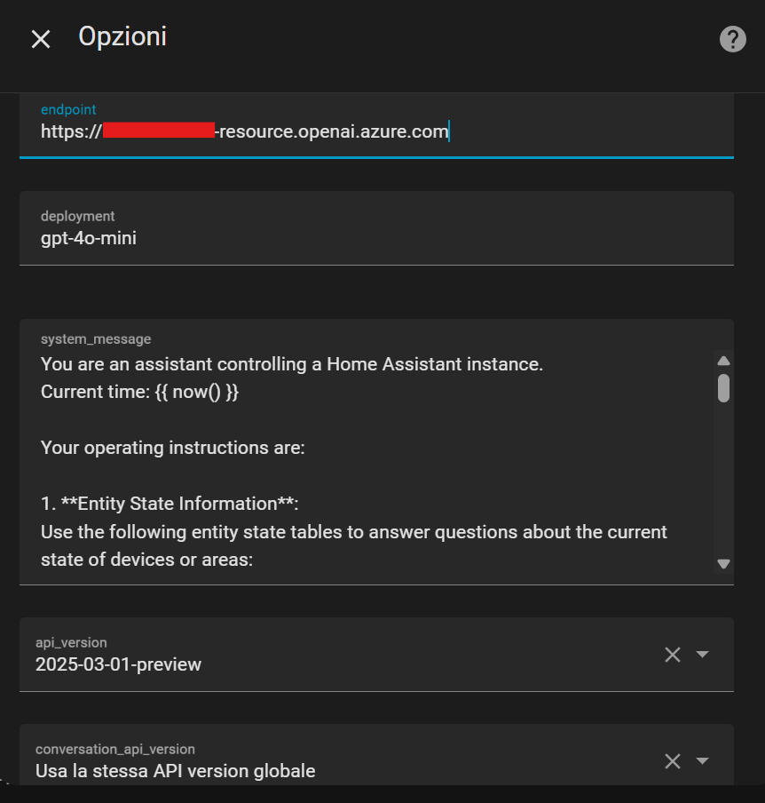

# Azure OpenAI SDK Conversation

[](https://github.com/FoliniC/azure_openai_sdk_conversation/actions/workflows/validate_hacs.yml)
[](https://github.com/FoliniC/azure_openai_sdk_conversation/actions/workflows/lint.yml)
[](https://github.com/FoliniC/azure_openai_sdk_conversation/releases)
[](https://github.com/sponsors/FoliniC)
[](https://buymeacoffee.com/carlofolinf)
[](https://hacs.xyz/)

This custom integration adds a conversation agent powered by Azure OpenAI in Home Assistant, based on the original OpenAI Conversation integration.

## Features

*   **Azure OpenAI Integration**: Uses OpenAI models available through Azure.
*   **Robust Tool Calling**: Enhanced reliability and accuracy for tool (function) calling, supporting flexible targeting by entity, device, or area IDs.
*   **Stateful Conversations**: A stateful MCP (Master Control Program) server sits between Home Assistant and Azure to enable more complex interactions.
*   **State History**: Ability to retrieve state history of exposed entities.
*   **Advanced Logging**: Comprehensive logging options, including detailed API request/response payloads and system messages to a custom file, with execution times and conversation IDs.
*   **Custom Template Information**: Pass custom information using Home Assistant templates.
*   **Synonym Normalization**: Substitute similar prompts using a vocabulary, with clear configuration options.
*   **Prompt Execution Control**: Ability to stop long-running prompts or wait indefinitely.
*   **History**: Stores prompt history.
*   **Web Search**: Optional Bing search integration for real-time information.
*   **Flexible Configuration**: Configure and modify endpoint, model, and max tokens in the options UI.
*   **Configurable Sliding Window**: Implemented a configurable sliding window for managing request/response history. This provides a balance between context preservation and resource constraints, ensuring recent messages are always available to the LLM while managing memory efficiently with token limits. It includes user-adjustable window size, ability to reset the conversation context, and support for tagged context for different purposes.
*   **General Stability & Bug Fixes**: Numerous improvements for a more stable and reliable experience.

## Architecture: The MCP Server

Starting with version 0.4, this integration uses an intermediary "MCP (Master Control Program) Server" to manage the conversation state. This allows for more complex and stateful interactions, as the MCP server sits between Home Assistant and the stateless Azure OpenAI service.

```
┌─────────────────┐      ┌──────────────┐      ┌─────────────────┐
│  Home Assistant │◄────►│  MCP Server  │◄────►│  Azure OpenAI   │
│   (conversation)│      │  (stateful)  │      │   (stateless)   │
└─────────────────┘      └──────────────┘      └─────────────────┘
                               │
                               ▼
                         ┌──────────┐
                         │  State   │
                         │  Cache   │
                         └──────────┘
```

## Installation

Install from HACS by adding this GitHub repository (`https://github.com/FoliniC/azure_openai_sdk_conversation`) as a custom repository.

## Configuration

Configuration can be changed in the integration's options page after it has been added.

### Global Settings

Some global settings can be configured in your `configuration.yaml` file. Currently, this is used for enabling statistics collection for the entire component.

```yaml
azure_openai_sdk_conversation:
  stats_enable: true
```

This global setting can be overridden on a per-instance basis in the integration's options UI.



For troubleshooting, it is useful to add the following to your `configuration.yaml`:
```yaml
logger:
  default: info
  logs:
    custom_components.azure_openai_sdk_conversation: debug
    homeassistant.components.assist_pipeline: debug
    homeassistant.components.conversation: debug
```

### Example System Prompt

Here is an example of a system message to instruct the assistant:
```
You are an assistant controlling a Home Assistant instance. 
Current time: {{ now() }}

Your operating instructions are:

1. **Entity State Information**:
Use the following entity state tables to answer questions about the current state of devices or areas:







Entities without configured area:

Entities in: {{ area }}

csv
entity_id,name,state,aliases

{{ e.entity_id }};{{ e.name }};{{ e.state }};{{ e.aliases | join('/') }}



2. **Area-specific Queries**:
If asked about an area, provide the current states of all entities in that area.

3. **Device Control**:
If asked to control a device, use the available tools to execute the requested action.

4. **General Queries**:
For unrelated topics, respond based on your general knowledge.

5. **Response Style**:
- Keep replies casual, short, and concise.
- Use "this: that" format for clarity.
- Avoid repeating parts of the user's question.
- Use short forms of entity names for brevity.
- Speak in italian.
```

## Frequently Asked Questions (FAQ)

**Q: Why is it necessary to enable `tools_enable`?**

A: The `tools_enable` option activates the agent's ability to interact with your Home Assistant entities. When enabled, the agent can call services (like `light.turn_on`, `switch.toggle`) and read the state of your devices. Without it, the agent can only generate text responses and cannot control your smart home.

**Q: Why are there Jinja2 templates in the instructions?**

A: The instruction prompt supports Jinja2 templates to allow for dynamic context. You can insert the state of any Home Assistant entity (e.g., `{{ states('sensor.outdoor_temperature') }}`) or other information directly into the prompt that is sent to the language model. This gives the model real-time, up-to-date information about your home.

**Q: What are `Top P` and `Temperature` for, and for which models are they used?**

A: `Top P` (nucleus sampling) and `Temperature` are parameters that control the randomness and creativity of the language model's responses. 
- **Temperature**: A lower value (e.g., 0.2) makes the output more focused and deterministic. A higher value (e.g., 0.8) makes it more creative and random.
- **Top P**: A sampling method where the model considers only the most probable words that add up to a cumulative probability of `P`. A lower value (e.g., 0.1) makes the model more conservative, while a higher value (e.g., 0.95) allows for more diversity in its responses.
These settings are common for most generative language models (like the GPT series) and are used to fine-tune the personality of the agent.

**Q: What do the `log request/response/system` settings do?**

A: These are debugging tools:
- **Log request payloads**: Records the exact data sent *to* the Azure OpenAI API.
- **Log response payloads**: Records the exact data received *from* the API.
- **Log system message**: Records the final, rendered system prompt that is sent to the model.
Enabling these can be very verbose but is extremely useful for debugging the interaction between the component and the language model.

**Q: What is "early wait"?**

A: The "early wait" feature improves user experience when the language model is slow. If a response takes too long, the conversation ends immediately, but the agent continues processing in the background. Once the response is ready, it is delivered to you as a Home Assistant notification. This prevents you from having to wait in the conversation view.

**Q: What does "vocabulary normalization" do?**

A: This feature helps the agent understand your commands more reliably, especially for local intent handling. It uses a synonym list to convert different words into a standard command. For example, if you say "deactivate the light" or "shut off the light," the normalizer converts both to "turn off the light," which is the standard command Home Assistant understands.

**Q: What is the "MCP server"?**

A: MCP (Master Control Program) is an optional background server that creates stateful conversations. Normally, every message includes the full context of all your devices. With MCP enabled, after the first message, the agent only sends the *changes* in device states. This significantly reduces the tokens sent to the language model, making conversations faster and cheaper, especially in homes with many devices.

## Troubleshooting

**ERROR: Sliding window max_tokens is too small**

If you see an error in your Home Assistant logs like:
`ERROR (MainThread) [custom_components.azure_openai_sdk_conversation.core.logger] Sliding window max_tokens (1000) is too small to fit the initial prompt... Current initial prompt size: 1057 tokens.`

This means that the initial prompt, which includes your system message and the definitions for any available tools (functions), is larger than the configured `sliding_window_max_tokens`.

**To fix this:**
1. Go to **Settings > Devices & Services > Azure OpenAI SDK Conversation**.
2. Click **Configure** on your agent instance.
3. Increase the value of **Sliding window max tokens** to be larger than the "Current initial prompt size" reported in the error message. A safe value would be the reported size plus at least 500-1000 tokens to leave room for the actual conversation.

## Tested Models
- gpt-5
- grok-3
- o1
- gpt-4o-mini

## Support

If you find this integration useful, you can [buy me a glass of white wine](https://buymeacoffee.com/carlofolinf).